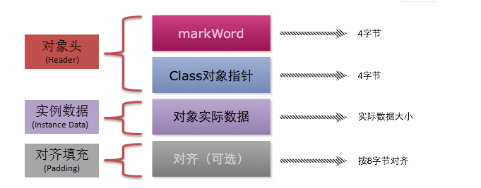

# Java 线程

## 内存模型（JMM）
    


JVM 为每一个线程分配一个内存区域，这个内存区域其实是虚拟的，实际上是寄存器、缓冲内存...，还会为成功程序分配一个主内存区域，每个
主内存区域，存放共享变量
  
可见性：指线程之间的共享变量，对于他们的操作是可见的，就是说线程1操作共享变量，线程2也同时要操作该共享变量，那么要等线程1将该共
享变量的操作完成，并刷新到主内存时，线程2才会操作该共享变量。java中提供维护共享变量可见性的操作

关键字：volatile，修饰变量，可以使得该变量在内存中可见

## 指令重排序

JVM 为了提高CPU的运行效率，在执行代码时会进行指令重排序操作，即不按照代码编写的顺序执行

数据依赖性： 如果两个操作访问同一个变量，且这两个操作中有一个为写操作，此时这两个操作之间就存在数据依赖性。指令2的操作依赖指令1的操作结果

有三种数据依赖性的情况：指令1 写入，指令2 读取；指令1 写入，指令2 再次写入；指令1读取，指令2写入；

单线程任务中，具有数据依赖的指令是不会重排序的，而多线程中，就不一定了

volatile关键字会禁止指令重排序，在不适合的场景使用，会破坏程序的性能，不能保证复合操作的原子性

原子性：一组操作不可分割，要么都执行，要么不执行

happens-before原则：
1. 程序次序规则：在一个单独的线程中，按照程序代码的执行流顺序，（时间上）先执行的操作happen—before（时间上）后执行的操作。
2. 管理锁定规则：一个unlock操作happen—before后面（时间上的先后顺序，下同）对同一个锁的lock操作。
3. volatile变量规则：对一个volatile变量的写操作happen—before后面对该变量的读操作。
4. 线程启动规则：Thread对象的start（）方法happen—before此线程的每一个动作。
5. 线程终止规则：线程的所有操作都happen—before对此线程的终止检测，可以通过Thread.join（）方法结束、Thread.isAlive（）的
返回值等手段检测到线程已经终止执行。
6. 线程中断规则：对线程interrupt（）方法的调用happen—before发生于被中断线程的代码检测到中断时事件的发生。
7. 对象终结规则：一个对象的初始化完成（构造函数执行结束）happen—before它的finalize（）方法的开始。
8. 传递性：如果操作A happen—before操作B，操作B happen—before操作C，那么可以得出A happen—before操作C。

## synchronized
    
一种锁机制，用来保证操作的原子性
    
四种用法：

1. 修饰普通方法：作用范围为该方法中的代码，保证该代码操作的原子性，锁对象为调用的对象，也成为this锁
2. 修饰静态方法：作用范围为该静态方法中的代码，保证该静态代码操作的原子性，锁对象为调用类的类对象  class对象
3. 修饰代码块 ： 作用范围为该代码块中的代码，锁对象为传入代码块的锁，所有线程必须公用同一锁对象
    
锁优化 ： java 1.6 对锁机制进行了大量的优化

1. 自旋锁 ： 在等待锁对象释放时，不挂起，一直占用CUP资源，如果线程执行操作快速的话，优化性能比较高
2. 自适应自旋锁 ： 单线程操作执行快速，自旋，如果超出一定时间，则挂起线程
3. 锁消除 ： 当检测到没有与该线程竞争的其他线程时，自动将锁消除，释放多余CPU资源，提高性能
4. 锁粗化 ： 当检测到同一锁下的代码不存在竞争关系的时候，会将两段代码合并到同一同步代码块中
5. 偏向锁 ： 当第一个线程启动时，锁会偏向与该线程，线程结束后，不会再有加锁、解锁过程，直到有其他竞争线程获取该锁，如果没有竞争线程，
就免去了加锁解锁操作，提高性能

实现机制：
    
Java 对象头 所对象在系统中的内存结构
    
锁存在 Java 对象头里。如果对象是数组类型，则虚拟机用 3 个 Word（字宽）存储对象头，如果对象是非数组类型，则用 2 字宽存储对象头。
在 32 位虚拟机中，一字宽等于四字节，即 32bit，在 64 位虚拟机中，一个字节等于8个字节，即64bit

java对象的内存结构



锁信息存储在mark wrod结构中，其结构如下图


    
java中的锁状态：

1. 无锁状态
2. 偏向锁

    ``` java
        1.获取偏向锁
             当一个线程访问同步块并获取锁时，会在对象头和栈帧中的锁记录里存储锁偏向的线程ID，以后在该线程进入和退出同步块时不需
        要CAS操作来加锁和解锁（不需要将mark Word设置为空），只需要简单的测试一下对象头的Mark Word里是否存储着指向当前线程的偏向
        锁。如果测试成功，表示线程已经获得了锁。如果测试失败，则需要再测试一下Mark Word中偏向锁的标志是否设置成1（可以通过java参
        数-XX:-UseBiasedLocking 关闭偏向锁，默认打开），如果没有设置，使用CAS竞争锁，如果设置了，则尝试使用CAS将对象头的偏
        向锁指向当前线程。
        2.偏向锁的撤销
            撤销次数：在mark Word中记录了偏向锁的撤销次数，如果这个次数太多，当再有线程获取该锁时，直接升级到轻量级锁，这个值记录
        在Epoch字节内，超过一定数量，说明该锁不适合在作为偏向锁
            撤销流程：线程1获取偏向锁，当有线程2获取该锁时，尝试使用CAS将对象的偏性锁指向自己，此时，要等到线程1进入安全区（没有
        字节码在执行的时候），暂停线程1，判断线程1是否还活着，不活着，直接将偏向锁指向线程2，如果活着，判断是否还竞争，不竞争，直
        接将偏向锁指向线程2，如果竞争，那么锁对象mark word中会撤销偏向锁结构，升级为轻量级锁结构
    ```
   
3. 轻量级锁

    ``` java
        1.自旋等待
            当有其他线程竞争锁时，如果锁被占用，就会自旋进行等待，不会挂起，进入阻塞状态
        2.自适应自旋
            虚拟机根据统计与检测结果，来动态的决定自旋时间，如果超出此时间，将升级为重量级锁，使用CAS竞争锁对象，进入阻塞状态
    ```
   
4. 重量级锁
    
    没有优化前的synchronized锁
    
## CAS  Compare And Swap
    
轻量级的无锁同步方法，不用锁来更新数据，预期值A、内存中的V、修改的值B，如果预期值A与内存中的值V相等，就将内存中的值V赋值为B

优点：  

1. 不使用锁机制，线程不会进入挂起、唤醒操作，不会浪费大量资源

缺点：

1. 循环时间长
2. 不能保证一个共享变量的原子操作
3. 导致ABA问题的出现，内存中的值开始为预期值A，被其他线程改为B，最终由变为预期值A，此时交换内存值，但是内存中的值V已经被改变过了

解决ABA问题的方法，加版本号，JDK总提供了AtomicReference来进行CAS替换，除了比较预期值与内存值，还要比较该变量的修改标志

## AQS AbstractQueuedSynchronizer

1. 

       